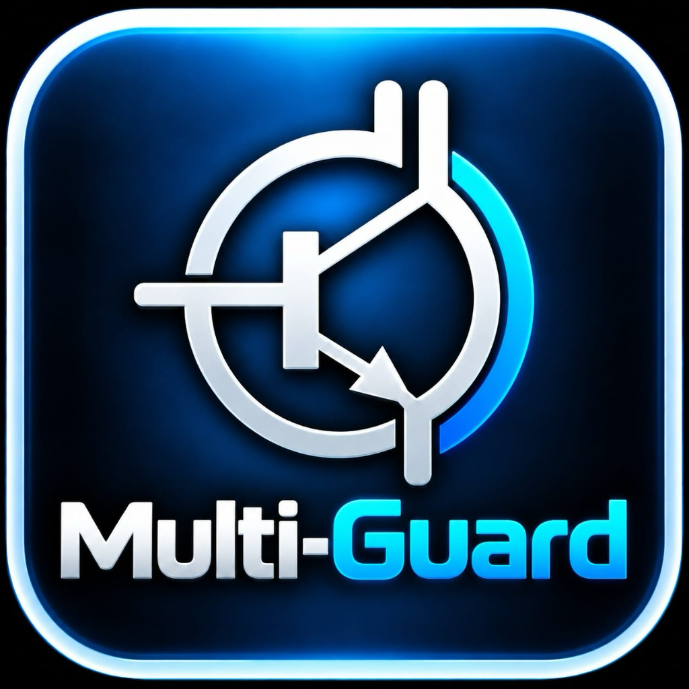

# 🛡️ Multi-Guard — Next-Gen Antivirus & Endpoint Security

<p align="center">
  
</p>

<p align="center">
  <strong>Maksymalna ochrona stacji roboczych. Zero zbędnego obciążenia.</strong><br/>
  <em>Wydajny, nowoczesny pakiet antywirusowy i narzędziowy dla systemów Windows, zintegrowany z KeyGate oraz Windows Security Center.</em>
</p>

<p align="center">
  <a href="#"></a>
  <a href="#"></a>
  <a href="https://github.com/kacperjelinski1/multi-guard"></a>
  <a href="LICENSE"></a>
  <a href="https://multi-servis.pl"></a>
</p>

<p align="center">
  <a href="#-o-projekcie">O projekcie</a> •
  <a href="#-warianty-i-plany-licencyjne">Plany licencyjne</a> •
  <a href="#-kluczowe-moduły-i-funkcje">Kluczowe moduły</a> •
  <a href="#-architektura-i-bezpieczeństwo">Architektura</a> •
  <a href="#-instalacja-i-aktywacja">Instalacja</a> •
  <a href="#-kompilacja">Kompilacja</a> •
  <a href="#-kontakt-i-wsparcie">Kontakt</a>
</p>

---

## 📖 O projekcie

**Multi-Guard** to zaawansowany pakiet antywirusowy i diagnostyczny dla systemów Windows (7 SP1 do 11) opracowany w **C++17** i **Qt 5.14+**. Łączy wielowarstwowy silnik detekcji zagrożeń (**baza sygnatur SHA-256**, **skanowanie wzorców bajtowych**, **strukturalna analiza nagłówków PE**, **heurystyka behawioralna**) z chirurgiczną naprawą zainfekowanych plików wykonywalnych oraz pakietem narzędzi optymalizacyjnych.

W przeciwieństwie do tradycyjnych narzędzi, które jedynie kasują zainfekowane pliki, Multi-Guard posiada silnik **PE Repair Engine**, potrafiący bezpiecznie usuwać złośliwy kod z plików EXE i DLL z przywracaniem oryginalnego punktu wejścia (OEP).

Projekt jest bezpośrednio zintegrowany z systemem licencjonowania **KeyGate** (`https://license.multi-servis.pl`) opartym o kryptografię asymetryczną **Ed25519** oraz z systemem **Windows Security Center** (`root\SecurityCenter2`), dzięki czemu Microsoft Defender automatycznie rozpoznaje Multi-Guard jako aktywnego dostawcę ochrony.

---

## 💎 Warianty i Plany Licencyjne

Multi-Guard to **jedna zunifikowana aplikacja**, w której dostępność poszczególnych modułów definiowana jest przez aktywną licencję KeyGate:

| Moduł / Funkcja | Multi-Guard AV | Multi-Guard Secure | Multi-Guard Assist / PRO | ADMIN FULL |
|---|:---:|:---:|:---:|:---:|
| **Skaner na żądanie (Quick, Full, Custom)** | ✅ | ✅ | *zgodnie z planem* | ✅ |
| **Ochrona w czasie rzeczywistym (Real-Time Shield)** | ✅ | ✅ | *zgodnie z planem* | ✅ |
| **Szyfrowany skarbiec kwarantanny (AES-256)** | ✅ | ✅ | *zgodnie z planem* | ✅ |
| **Automatyczne skanowanie nośników USB** | ✅ | ✅ | *zgodnie z planem* | ✅ |
| **Baza sygnatur i aktualizacje online** | ✅ | ✅ | *zgodnie z planem* | ✅ |
| **Biała lista (Wykluczenia folderów/plików)** | ✅ | ✅ | *zgodnie z planem* | ✅ |
| **Tarcza Ransomware (Canary Guard / Sentinel)** | ❌ | ✅ | *zgodnie z planem* | ✅ |
| **Ochrona sieciowa (WebShield & audyt hosts)** | ❌ | ✅ | *zgodnie z planem* | ✅ |
| **Naprawa Windows (VC++, Firewall, Crypto, DLL)** | ❌ | ✅ | *zgodnie z planem* | ✅ |
| **Bezpieczna niszczarka plików (DoD 5220.22-M)** | ❌ | ✅ | *zgodnie z planem* | ✅ |
| **Optymalizator dysku i czyszczenie śmieci** | ❌ | ❌ | *zgodnie z planem* | ✅ |
| **Menedżer autostartu Windows** | ❌ | ❌ | *zgodnie z planem* | ✅ |
| **Monitor podzespołów sprzętowych (HW Monitor)** | ❌ | ❌ | *zgodnie z planem* | ✅ |
| **Zdalna Naprawa Multi-Servis** | ❌ | ❌ | *zgodnie z planem* | ✅ |
| **Oficjalne raporty serwisowe (HTML)** | ❌ | ❌ | *zgodnie z planem* | ✅ |

### Okresy subskrypcji
- **Multi-Guard AV**: 3, 6, 9, 12 miesięcy
- **Multi-Guard Secure**: 3, 6, 9, 12 miesięcy
- **Multi-Guard Assist & Assist PRO**: 3, 6, 9, 12 miesięcy (dedykowane wsparcie serwisowe)
- **ADMIN FULL**: licencja bezterminowa (*perpetual*) z pełnym dostępem do wszystkich modułów.

---

## 🚀 Kluczowe Moduły i Funkcje

### 1. Wielowarstwowy Silnik Antywirusowy
- **Sygnatury SHA-256**: Błyskawiczne rozpoznawanie znanych zagrożeń w bazie SQLite/JSON.
- **Pattern Matcher**: Wyszukiwanie sygnatur binarnych z obsługą masek i wildcardów.
- **PE Structural Analysis**: Weryfikacja podejrzanych sekcji (RWX, nietypowe nazwy, zawyżony rozmiar wirtualny jak Floxif).
- **Heurystyka i skrypty**: Analiza podejrzanych pobrań PowerShell, skryptów VBS/JS i makr pakietu Office.

### 2. Tarcza Ransomware (Canary Guard)
- Monitorowanie wrażliwych katalogów użytkownika (Dokumenty, Pulpit, Obrazy).
- Zaawansowane pliki-pułapki (*canary files*) natychmiast wykrywające próby masowego szyfrowania i blokujące podejrzane procesy.

### 3. Integracja z Windows Security Center (WSC)
- Architektura integracji przygotowana pod oficjalne API Microsoft Virus Initiative (MVI).
- Spójne raportowanie rzeczywistego stanu ochrony, silnika i bazy sygnatur.
- Brak wymuszania zmian w Defenderze – decyzję o przełączeniu stanu ochrony podejmuje natywnie system Windows.

### 4. Inteligentne Zarządzanie Oknem i Tray
- **Przycisk `X`**: Chowa okno do zasobnika systemowego (*system tray*) bez przerywania pracy w tle.
- **Przycisk `-`**: Prawidłowo minimalizuje aplikację do paska zadań Windows z zachowaniem ikony w trayu.
- **Menu zasobnika**: Szybkie skanowanie, podgląd stanu ochrony, pauzowanie tarcz, aktualizacje oraz bezpieczne zamykanie aplikacji.

### 5. Narzędzia Serwisowe i Optymalizacyjne
- **Naprawa Windows**: Naprawa pliku `hosts`, reinstalacja bibliotek VC++ Redistributable, naprawa reguł Zapory, usług kryptograficznych oraz sterowników.
- **Niszczarka plików**: Nieodwracalne niszczenie danych metodą DoD 5220.22-M (3 przebiegi: 0x00, 0xFF, dane pseudolosowe).
- **Raporty serwisowe**: Eksport oficjalnych raportów diagnostycznych stacji roboczej do formatu HTML.

---

## 🔒 Architektura Licencjonowania KeyGate

```
   [ Aplikacja Multi-Guard ]
              │
              ├─ 1. Unikalny MachineGuid (HKLM\...\Cryptography)
              ├─ 2. Fingerprint: hex(SHA256(did + ":" + pid)[0:8])
              │
              ▼
    [ Serwer KeyGate ] ──► https://license.multi-servis.pl
              │
              ▼
   Podpisany Token Ed25519: base64url(payload).base64url(signature)
              │
              ▼
   Lokalna weryfikacja (TweetNaCl, bez obcych DLL)
              │
              ├─ Zgodność podpisu cyfrowego z kluczem publicznym
              ├─ Weryfikacja powiązania ze sprzętem (Device Lock)
              └─ Sprawdzenie terminu ważności i uprawnień (Entitlements)
```

- **Klucz publiczny**: `ab51fb732f453762ba91bacb6fe18dd2b87fce313c4cc88c226b606599fcc1a3`
- **Product ID**: `9843d5fd-f090-4534-9d32-d66b64999acb`
- **Blokada po wygaśnięciu**: Przy braku ważnej licencji aplikacja przechodzi w stan blokady (`pageLicenseLocked`), odłączając moduły ochronne i udostępniając formularz odnowienia oraz bezpośredni kontakt z serwisem.

---

## 🛠️ Wymagania Systemowe

| Komponent | Wymagania minimalne | Zalecane |
|---|---|---|
| **System operacyjny** | Windows 7 SP1 (x86/x64) | Windows 10 / 11 (x64) |
| **Procesor** | 1.0 GHz x86/x64 | 2.0 GHz wielordzeniowy |
| **Pamięć RAM** | 512 MB | 2 GB lub więcej |
| **Miejsce na dysku** | 100 MB | 250 MB |
| **Uprawnienia** | Administrator (UAC) | Administrator |

---

## 💻 Kompilacja ze Źródeł

Projekt korzysta z systemu budowania **qmake** (Qt 5.14.2 / 5.15+ Static MinGW 32-bit lub 64-bit):

```cmd
:: 1. Klonowanie repozytorium
git clone https://github.com/kacperjelinski1/multi-guard.git
cd multi-guard

:: 2. Przygotowanie środowiska Qt/MinGW
set PATH=C:\Qt\5.14.2\mingw73_32\bin;C:\Qt\Tools\mingw730_32\bin;%PATH%

:: 3. Generowanie Makefile i kompilacja
qmake Verax.pro -spec win32-g++ "CONFIG+=release"
mingw32-make -j%NUMBER_OF_PROCESSORS%

:: 4. Gotowy plik wykonywalny znajdzie się w katalogu:
:: RELEASED\Multi-Guard.exe
```

---

## 📞 Kontakt i Wsparcie

W sprawach zakupu licencji, przedłużenia subskrypcji lub pomocy technicznej:

- 🏢 **Multi-Servis**
- 📞 **Infolinia / Serwis:** `505 012 914`
- 🌐 **Serwis:** [https://multi-servis.pl](https://multi-servis.pl)
- 🔑 **Portal Licencji:** [https://license.multi-servis.pl](https://license.multi-servis.pl)
- 🐙 **Repozytorium:** [https://github.com/kacperjelinski1/multi-guard](https://github.com/kacperjelinski1/multi-guard)

---

<p align="center">
  <em>Multi-Guard is powered by Multi-Servis Security Solutions. Copyright © 2026 Multi-Servis. Wszelkie prawa zastrzeżone.</em>
</p>
