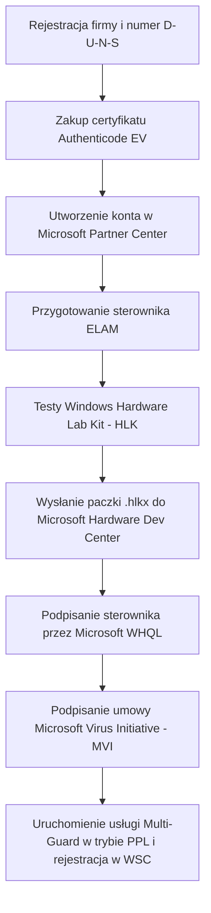

# Oficjalna Certyfikacja Antywirusowa Microsoft, ELAM i PPL

Niniejszy dokument przedstawia wymagania architektoniczne, prawne i techniczne stawiane przez firmę Microsoft producentom niezależnego oprogramowania antywirusowego (ISV) dla systemów **Windows 10** oraz **Windows 11**.

---

## 1. Czym jest Early Launch Anti-Malware (ELAM)?

**ELAM (Early Launch Anti-Malware)** to certyfikowany przez firmę Microsoft sterownik jądra (`.sys`), który jest ładowany przez procedurę startową systemu Windows (Boot Manager / Kernel Init) **przed wszystkimi innymi sterownikami firm trzecich** i usługami systemowymi.

### Główne zadania sterownika ELAM:
1. **Wczesna inspekcja bootu**: Sprawdza integralność i reputację innych sterowników ładowanych podczas rozruchu (klasyfikacja: *Known Good*, *Known Bad*, *Bad but Boot Critical*, *Unknown*).
2. **Aktywacja ochrony PPL (Protected Process Light)**: Informuje jądro systemu, że usługa antywirusowa danego producenta ma prawo uruchomić się w chronionym trybie `PsProtectedSignerAntimalware` (tzw. `Antimalware-Light`).

---

## 2. Czy Multi-Guard potrzebuje ELAM?

**TAK, w środowisku produkcyjnym sterownik ELAM jest bezwzględnie wymagany.**

### Uzasadnienie techniczne:
* W systemach Windows 10 i Windows 11 rejestracja zewnętrznego antywirusa w **Windows Security Center** za pośrednictwem oficjalnego API (`wscapi.dll` / `IWscProduct`) jest zastrzeżona wyłącznie dla procesów działających z poziomem ochrony **PPL (Antimalware-Light)**.
* Zwykły proces użytkownika ani standardowa usługa systemowa (nawet z konta `NT AUTHORITY\SYSTEM` lub z podniesionymi uprawnieniami administratora) **nie może** zarejestrować się jako oficjalny dostawca antywirusa — próba wywołania prywatnego API kończy się błędem `E_ACCESSDENIED` (0x80070005).
* Jedynym wspieranym przez architekturę Windows mechanizmem uzyskania flagi `Antimalware-Light` dla usługi antywirusa jest jej autoryzacja przez zarejestrowany i podpisany przez Microsoft sterownik ELAM.

---

## 3. Komponenty wymagające podpisania cyfrowego

W architekturze Multi-Guard podpisania wymagają następujące elementy:

| Komponent | Typ pliku | Wymagany rodzaj podpisu | Urząd podpisujący |
| :--- | :--- | :--- | :--- |
| **Sterownik ELAM** | `.sys` | WHQL / Attestation Signing | **Microsoft Hardware Dev Center** |
| **Usługa antywirusowa** | `Multi-Guard.exe` (`--service`) | Authenticode EV + EKU Anti-Malware | Certyfikat producenta (EV) + Microsoft cross-sign |
| **Interfejs GUI & Narzędzia** | `Multi-Guard.exe` | Authenticode EV (Extended Validation) | Certyfikat producenta (EV HSM) |
| **Biblioteki dynamiczne** | `*.dll` (Qt, silnik, moduły) | Authenticode EV | Certyfikat producenta (EV HSM) |
| **Instalator** | `Multi-Guard-Setup.exe` | Authenticode EV | Certyfikat producenta (EV HSM) |

---

## 4. Przebieg procesu certyfikacji krok po kroku

### Krok 1: Weryfikacja tożsamości producenta
1. Posiadanie zarejestrowanej działalności gospodarczej / spółki.
2. Uzyskanie numeru **D-U-N-S** (Dun & Bradstreet).
3. Zakup certyfikatu **Code Signing EV (Extended Validation)** wydanego na fizycznym tokenie USB (HSM) lub w usłudze chmurowej (np. Azure Key Vault / DigiCert ONE).

### Krok 2: Konto w Microsoft Partner Center
1. Rejestracja w **Microsoft Partner Center** w programie *Windows Hardware Developer Program*.
2. Powiązanie konta z certyfikatem EV.

### Krok 3: Certyfikacja sterownika ELAM (HLK)
1. Przygotowanie stanowiska testowego z systemem **Windows Hardware Lab Kit (HLK)**.
2. Przeprowadzenie oficjalnego pakietu testów ELAM:
   - *Early Launch Anti-Malware Driver Test*,
   - *Driver Verification and Signature Test*.
3. Wygenerowanie podpisanej paczki wyników testów (`.hlkx`).
4. Przesłanie paczki do portalu Hardware Dev Center w celu uzyskania podpisu Microsoftu.

### Krok 4: Umowa Microsoft Virus Initiative (MVI)
1. Przejście niezależnych testów skuteczności i fałszywych alarmów (np. w laboratorium **AV-TEST**, **AV-Comparatives** lub **Virus Bulletin VB100**).
2. Złożenie wniosku o członkostwo w programie **Microsoft Virus Initiative (MVI)**.
3. Podpisanie umowy MVI NDA i uzyskanie dostępu do oficjalnego SDK integracji z Windows Security Center.

---

## 5. Czego NIE NALEŻY robić (Niedopuszczalne praktyki)

Firma Microsoft oraz system Windows Defender kategorycznie zabraniają:
* Wstrzykiwania kodu (DLL / Process Injection) do procesów systemowych.
* Używania narzędzi typu `defendnot` podszywających się pod procesy Microsoftu.
* Prób obchodzenia PPL poprzez nieudokumentowane manipulacje w strukturach jądra (`EPROCESS`).
* Modyfikowania kluczy rejestru `DisableAntiSpyware` lub wyłączania ochrony w czasie rzeczywistym komendami PowerShell `Set-MpPreference`.
* Bezpośredniego wpisywania fałszywych danych do przestrzeni WMI `root\SecurityCenter2`.

Każda próba zastosowania powyższych metod powoduje automatyczne oznaczenie programu przez Microsoft Defender jako zagrożenie bezpieczeństwa (np. `VirTool:Win32/DefenderTampering`) i zablokowanie instalatora.
